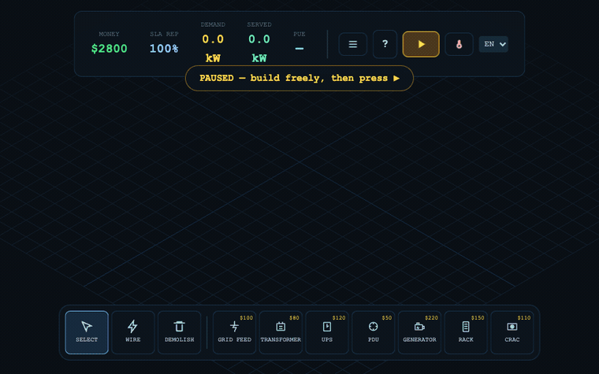

# Datacenter Survival

**You run the physical layer of the cloud.** Racks earn money while they are
powered and cool — everything else is the fight to keep those two things true.

Sister game of [Server Survival](https://github.com/pshenok/server-survival):
that one teaches the *logical* layer (services, routing, scaling); this one
teaches the *physical* layer it all runs on — megawatts, heat, cooling, PUE.

[](https://pshenok.github.io/datacenter-survival/)



*Real capture, sped up with the game's own fast-forward: the chain goes live →
the rack block cooks itself past 45 °C and throttles → CRACs answer it (and
push PUE up) → the city grid dies, and only the UPS-backed half of the room
stays lit until the standby generator picks up. Throughout, badges name the
building responsible for every kilowatt you fail to serve — and the ledger
totals it in dollars.*

## The two systems

- **Power is wired.** Grid Feed → Transformer → UPS → PDU → Rack. Every link
  has a kW capacity. Overload one and it clips its whole subtree
  proportionally — push it further and its **breaker opens**, because real
  gear does not dim forever. A UPS bridges a blip in seconds; a standby
  generator carries the rest, for exactly as long as there is fuel in it.
- **Heat spreads.** Every kW a rack draws becomes heat in the cells around
  it. CRAC units cool a radius — and draw power themselves, idle draw
  included, so two half-loaded units cost more than one working one. Above a
  certain size a **chiller** making chilled water for many **CRAH** heads
  beats cooling everywhere at once; below it, the plant's pumps cost more
  than they save. That is why your **PUE** (total facility power ÷ IT power)
  is both your score and your power bill. Press **T** for the thermal overlay
  and watch hot aisles form from your own layout.
- **The plant drinks.** A chiller's cooling tower rejects heat by evaporating
  water — around 1.8 litres per kWh, which is what the industry calls **WUE**
  and what the HUD shows beside PUE. It is cheap enough that the loop still
  wins, right up until a **drought** prices water twelve times over: then the
  air-cooled CRAC, strictly worse on power at every size, is the cheaper room.
  PUE is the number everyone quotes; WUE is the one that gets a datacenter
  into the local newspaper.

- **A run can be handed to someone else.** Free play takes a seed —
  `?seed=KYIV`, or type one on the menu — and every crisis, every contract
  and every price window in that run is drawn from it. Two people playing
  `?seed=KYIV` get the same brownout at the same second, so "I held PUE 1.19
  for four minutes" stops being a claim and starts being something you can
  check. The seed rides along in the address bar; the game-over screen hands
  you the link. Without a seed nothing changes — the game is as random as it
  always was.

Overheated racks throttle, throttled racks miss SLA, missed SLA drains
reputation and money. And every kilowatt you fail to serve is **named**:
badges float the cause over the building responsible, and the ledger totals
the run in dollars — `Where the $65 went: AT CAPACITY 61%, TOO HOT 20%…`.

## The campaign

Thirteen levels in five chapters, each teaching one mechanic and each proven —
by machine-played tests — to be **winnable with that mechanic and losable
without it**.

- **Chapter 1 · Power & Heat** — the delivery chain, the hot aisle, PUE and
  placement, a grid sag that only headroom rides out, and a blackout that
  only a charged UPS bridges.
- **Chapter 2 · Backup** — a standby generator, its transfer switch, and the
  fuel gauge that is the real capacity of your backup.
- **Chapter 3 · Diagnosis** — levels that hand you a room that is already
  running and already wrong: four CRACs burying the PUE, four racks sharing
  one bus until its breaker opens, cooling installed in the wrong corner,
  and two "redundant" feeds that turn out to share a substation.
- **Chapter 4 · Scale** — one chiller plant feeding many cooling
  heads: cheaper than cooling everywhere at once, right up until the day the
  plant stops and every head on it stops together.
- **Chapter 5 · Serviceable** — scheduled work orders with a deadline: Tier
  III isn't "has a backup", it's concurrent maintainability — any element can
  be pulled for planned work while the load keeps running, which is a
  statement about spare capacity, not about spare parts.

Optional bonus objectives sit on a different axis than the level's own goal
— serve *through* the sag, or bridge three blackouts and still finish with
money in the bank.

**The Lab** sits below them and is open from the first minute, because a
rehearsal room behind thirteen wins is a trophy. It is a working hall — one
chain with a UPS, a standby generator already wired to the transformer, three
racks and a CRAC — with live knobs for demand, ambient temperature and the
tariff band, and buttons that fire a heatwave, a brownout, a grid outage, a
peak-price window or a CRAC failure on demand. There are no objectives, no
clock and nothing to lose. Every crisis in the rest of the game is on a
schedule, so understanding the transfer switch costs you 220 seconds of
waiting and gets you one look at it; here you can watch the same one until
you can predict it.

## What it teaches

- The datacenter power chain, and why a breaker opening is not the problem
- Thermal design: hot and cold aisles emerge from placement, not from rules
- PUE as a profit lever, and why over-cooling is as expensive as under-cooling
- Redundancy that is real (independent substations) versus redundancy that
  is decoration
- Batteries bridge seconds, generators carry hours, fuel is the actual limit
- Shared cooling is shared efficiency and shared blast radius — the same
  property, and scale decides which one you get
- WUE, and that efficiency has a second bill: the loop buys its power
  advantage with evaporated water, and a drought is what makes that matter
- Diagnosis: reading an attribution ledger instead of guessing

## Running it

**To play, click [PLAY NOW](https://pshenok.github.io/datacenter-survival/).**
Nothing to install, nothing to build, no account. That is the whole setup.

**No build step** anywhere: the repo is served raw by GitHub Pages — native ES
modules, Three.js from CDN, not a line of it compiled. To run *your own copy*
(a fork, or a change you just made) you need a static server rather than the
file itself, because browsers fetch module scripts in CORS mode and a
`file://` origin is opaque to them. Double-clicking `index.html` gets you a
HUD over an empty screen. One line fixes it, and it is already on your
machine:

```bash
python3 -m http.server 8000    # then open http://localhost:8000
```

For contributors: `npm i && npm run check` runs ESLint and the Vitest suite.
The simulation is tested headless (power conservation, heat conservation,
loss attribution that must sum exactly, breaker timing, no-NaN invariants),
and every campaign level is machine-played in both directions. `npm run
demo:capture && npm run demo:gif` re-records the README animation from a
real playthrough.

## Status

Thirteen campaign levels across five chapters plus The Lab, nine buildings,
515 tests. Simulation: wired power with inverse-time breakers, a diffusing
heat field with part-load cooling, a shared chilled-water loop metered for
water on a WUE, UPS buffers, standby generators with fuel, grid sags,
per-substation outages, time-of-use and peak tariffs, droughts, peak shaving
off the UPS battery, rolling contracts, seeded shareable runs, and per-cause
loss attribution. English and Ukrainian.

Peak shaving is a toggle, not an upgrade. A charged UPS can serve its subtree
from the battery instead of the meter, but the battery gives back less than
it takes, so the round trip only pays if you spend it into a band that is
dearer than the one you buy it back in. Left switched on at a flat price it
loses money and leaves you with no ride-through — the FAQ's Shaving tab has
the numbers, generated from the same config the simulation bills from.

The Lab was the last open item on the roadmap
([#5](https://github.com/pshenok/datacenter-survival/issues/5)); it is in.
What comes next is whatever a level turns out not to be able to teach.

## Contributing

The bar is that a mechanic has to teach something true — a mechanic that
plays well and models the physics dishonestly is a bug. Everything a
contributor needs is in [CONTRIBUTING.md](CONTRIBUTING.md), with the
invariants behind it in [docs/ARCHITECTURE.md](docs/ARCHITECTURE.md).

Starting points: anything tagged
[good first issue](https://github.com/pshenok/datacenter-survival/issues?q=is%3Aissue+is%3Aopen+label%3A%22good+first+issue%22)
is a real, verified gap with the fix already located. Questions and mechanic
proposals go to
[Discussions](https://github.com/pshenok/datacenter-survival/discussions).
